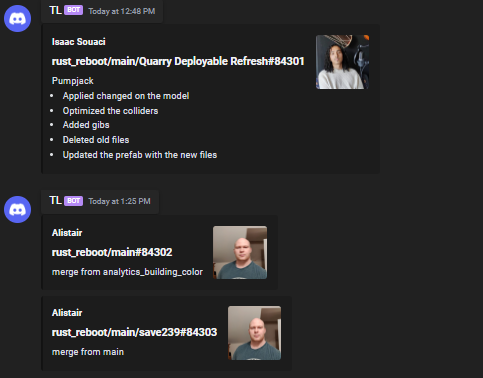

# RustCommitsToDiscord


## Dumb python script that checks for new Rust commits on https://commits.facepunch.com/r/rust_reboot and sends them to your discord webhook every 50 seconds.

To run first clone the repo and cd in to it:
```
git clone https://github.com/GloftOfficial/RustCommitsToDiscord
cd RustCommitsToDiscord
```
Make sure to edit `bot.py` with your discord webhook
Then Install required packages and run:
```
pip install -r requirements.txt
python bot.py
```

